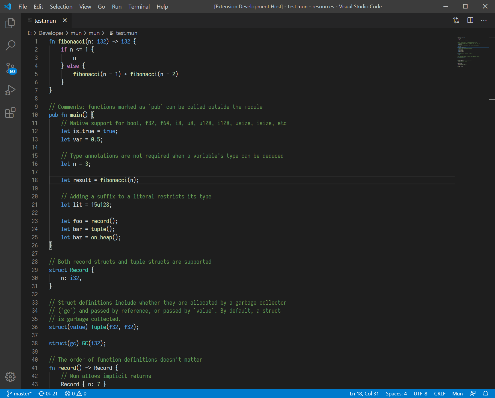

This month marked the release of a new version of Mun. It took us quite some
time but after almost half a year, [Mun v0.2 is out
now](../../16/release-mun-v0-2-0)! The most important feature of Mun v0.2? We
now support hot reloadable structs.

#### Community

After the release of Mun v0.2 we saw an influx of community members, who pulled
together to fix some of the issues in the release:

* **fix(docs): remove return-blocking semicolon from ch01 listing 01** [[PR#192]](https://github.com/mun-lang/mun/pull/192)
* **fix(docs): code blocks in ch02-02-functions of the book** [[PR#194]](https://github.com/mun-lang/mun/pull/194)
* **fix(docs): missing arg for fibonacci fn** [[PR#197]](https://github.com/mun-lang/mun/pull/197)

Our [Discord](https://discord.gg/SfvvcCU) also saw a spike in user activity and
we have had some really fruitful discussions there. We hope to include the
community more and more in the entire design & development process. To that end
we have added several [tracking
issues](https://github.com/mun-lang/mun/issues?q=is%3Aissue+is%3Aopen+label%3Atracking)
for new features that we want to develop in the coming months.

Besides tracking issues we have also added additional [*good first issues*][gfi] on Github, which is a
good starting point for anyone who wants to get involved with Mun:

* **Implement compatibility checks between munlib and runtime** [[issue#188]](https://github.com/mun-lang/mun/issues/188)
* **Test Mun examples in the book** [[issue#209]](https://github.com/mun-lang/mun/issues/209)

If you are interested in helping develop Mun - but are not sure where to start -
feel free to reach out to us on [Discord](https://discord.gg/SfvvcCU) or
[Twitter](https://twitter.com/munlangorg). To support our cause, please consider
donating to our [Open Collective][oc].

[gfi]: https://github.com/mun-lang/mun/issues?q=is%3Aissue+is%3Aopen+label%3A%22good+first+issue%22
[oc]: https://opencollective.com/mun

#### v0.2

At the start of this month we were able to put the finishing touches to the
second release of Mun. As mentioned, the Mun v0.2 release features hot
reloadable data structures that are automatically [memory
mapped](../../01/memory-mapping), but that's far from all new goodieness. Some
other interesting features that were added this month are:

* **feat: implements number type inferencing** [[PR#154]](https://github.com/mun-lang/mun/pull/154)
  ```mun
  fn integer() -> i32 {
      0 // inferred as i32
  }
  fn large_unsigned_integer() -> u128 {
      0 // inferred as u128
  }
  fn with_let() -> u16 {
      let b = 4;    // inferred as u16
      let a = 4;    // inferred as u16
      a
  }
  ```

* **misc: removed float, int, uint** [[PR#157]](https://github.com/mun-lang/mun/pull/157)
    
  Now that we have sized scalar types, there was no longer a need for generic
  `int` and `float` types. As they were only confusing for new users, we
  removed them.

* **feat(book): add book to main repository** [[PR#182]](https://github.com/mun-lang/mun/pull/182)
  We integrated the Mun [book](https://docs.mun-lang.org/) into the main
  repository, such that we can automatically [test all its
  examples](https://github.com/mun-lang/mun/issues/209) during CI builds - in
  the future. With the release of Mun v0.2, a lot of content was added to the
  book. The book of Mun v0.2 is available
  [here](https://docs.mun-lang.org/v0.2/).

The complete list of changes for Mun v0.2 can be found in the [release
notes](https://github.com/mun-lang/mun/releases/tag/v0.2.0).

#### VSCode Plugin

We launched an official Visual Studio Code plugin that adds full support for
syntax highlighting of Mun v0.2 code. Our goal is to extend this plugin to
better integrate with VSCode through the language server protocol. This will
hopefully also benefit other editors in the future. The plugin is available on
the [VisualStudio
Marketplace](https://marketplace.visualstudio.com/items?itemName=mun-lang.mun)
and on [Github](https://github.com/mun-lang/vscode-extension).



Fun fact: The plugin also drives syntax highlighting on this website.

#### v0.3

Now that Mun v0.2 is out of the door, we can focus on developing the next
version of Mun. We work according to a tick-tock release cycle. During a tick
release we implement new language features, whereas a tock release focuses on
bettering the status quo by removing technical debt, fixing bugs, and improving
overall ergonomics. Since Mun v0.2 was a tick release, Mun v0.3 will be a tock
release.

We try to be as transparent as possible, so to that end we posted a [high-level
roadmap](https://github.com/mun-lang/mun/milestones) on Github that details
new features for the upcoming two releases - Mun v0.3 & v0.4 - as well as a
backlog of features that are still to come. We also assigned milestones to and
labelled all issues to make them more insightful. The milestones can be
reviewed in [this overview](https://github.com/mun-lang/mun/milestones).

Our goal is to release Mun v0.3 a lot sooner than Mun v0.2. Hopefully after a few
months instead of half a year. Please stay tuned!
