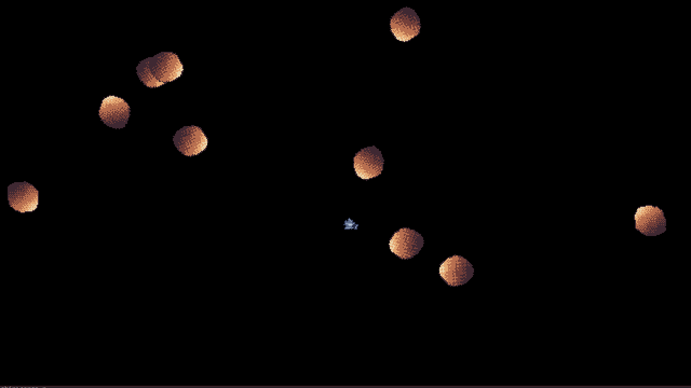
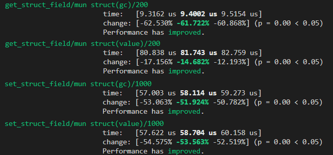

A long list of community contributions, big marshalling performance improvements, technical debt flying out of the window, and a Rustacean Station podcast with the two Mun Core Team members. That can only mean one thing: yet another month of Mun development has come and gone.

At the end of last month, [Rustacean Station](https://rustacean-station.org/) released [a podcast
about Mun](https://rustacean-station.org/episode/020-mun/) in which we sat down with host Jeremy to
talk about why we chose Rust to develop Mun. If you are interested in having an inside look into
Mun's origins and evolution, we recommend you check it out - or any of Rustacean Station's other
podcasts for that matter!

#### Community

This month we had some new and exciting community contributions:

* **feature: initial LSP support** [[PR#236]](https://github.com/mun-lang/mun/pull/236)
* **feat: add Spaceship example** [[PR#1]](https://github.com/mun-lang/example-rs/pull/1)
    After having received a lot of *Break It* contributions, this Spaceship game marks the first
    *Make It* contribution for season 1 of our [*Make It or Break It*][miobi] contest, pushing the
    limits of Mun to Rust marshalling.

    
* **improvement(tools): bump bindgen dependency to 0.54** [[PR#242]](https://github.com/mun-lang/mun/pull/242)
* **fix(parser): parsing of unmatched right curly braces ('}')** [[PR#243]](https://github.com/mun-lang/mun/pull/243)
* **fix: removed outdated comments** [[PR#245]](https://github.com/mun-lang/mun/pull/245)
* **feat(cli): Implement `mun new` and `mun init`** [[PR#246]](https://github.com/mun-lang/mun/pull/246)

Thank you for all of your contributions, and a warm welcome for our new community contributors!

We have added one additional [*good first issue*][gfi] on Github, which is a good starting point for
anyone who wants to get involved with Mun:

* **Pin Rust version** [[issue#247]](https://github.com/mun-lang/mun/issues/247)

If you are interested in helping develop Mun - but are not sure where to start - feel free to reach
out to us on [Discord](https://discord.gg/SfvvcCU) or [Twitter](https://twitter.com/munlangorg). To
support our cause, please consider donating to our [Open Collective][oc] or [Github Sponsors][gs].

[miobi]: https://github.com/mun-lang/mun/issues/220
[gfi]: https://github.com/mun-lang/mun/issues?q=is%3Aissue+is%3Aopen+label%3A%22good+first+issue%22
[oc]: https://opencollective.com/mun
[gs]: https://github.com/sponsors/mun-lang

#### Mun v0.3 progress

The Mun Core Team has been making steady progress on other improvements and refactoring for our Mun
v0.3 release. With this *tock* release we hope to improve the user experience for people writing and embedding Mun, as well as enhance the developer experience for people contributing to Mun.

* **improvement(runtime): add benchmarks for and optimise struct field marshalling** [[PR#238]](https://github.com/mun-lang/mun/pull/238)
    Based on feedback from the [Veloren Team](https://veloren.net/) we started some guided
    optimisation of our struct marshalling code, which has resulted in huge improvement:
    
    
* **misc(ci): build binaries for release branches** [[PR#240]](https://github.com/mun-lang/mun/pull/240)
* **refactor: upgrade to salsa 0.15** [[PR#244]](https://github.com/mun-lang/mun/pull/244)

In the coming month we'll be finishing up our [Inkwell](https://github.com/TheDan64/inkwell)
upgrade, allowing us to release our compiler crates in the future while cleaning up some technical
debt in the process. At the same time, we are adding support for multi-file projects to our ABI,
compiler, and runtime.

For more details, please check out our [high-level
roadmap](https://github.com/mun-lang/mun/projects/2) on Github that details new features for the
upcoming two releases - Mun v0.3 & v0.4 - as well as a backlog of features that are still to come.
