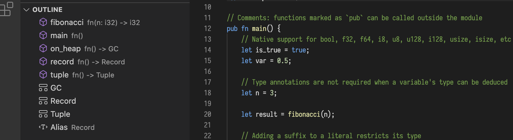

Revitalized from the holiday break, the core team got cracking, resulting in half a dozen completed pull requests and even more in review. What's more, some fresh blood is dipping their toe in the Mun pond, as we kick off the new year.

#### Mun v0.3 progress

It's been a while since we had as much progress as in January, so to refresh your memory: Mun v0.3 is a *tock* release.
This means that we focused on improvements to the user experience - for people writing and embedding Mun - and enhancements to the developer experience - for people contributing to Mun.
In particular, a lot of work went into providing a better editing experience with more additions to the language server.

* **feat(language server): integrated new vfs** [[PR#294]](https://github.com/mun-lang/mun/pull/294)

  Previously we used `ra_vfs` from Rust Analyzer to manage all file handling in our language server. 
  Rust Analyzer moved away from that crate and implemented a custom solution. 
  With the introduction of Rust 1.49 we encountered some clippy errors in our use of `ra_vfs`. 
  We followed suite and implemented a (much simpler) custom solution. 
  This PR introduces a virtual filesystem that keeps a consistent state of all files currently used in our analysis in memory.
  It also provides a way to monitor the filesystem for changes and atomically applies these changes to the in-memory state.
  In the future the goal is to use this same functionality for our `watch` mode, when building the source.

* **feat(language server): removed async code and switched to lsp_server** [[PR#295]](https://github.com/mun-lang/mun/pull/295)
  
  `async` is a great feature of Rust. 
  We've used it a lot in our implementation of the language server. 
  However, this was also really the only place that actually benefited from async IO. 
  A lot of our asynchronous code consists of fire-and-forget computations, which don't really benefit from Rust's async approach and instead work very well in a simple thread-pool.
  Besides that, our async implementation required a lot of boilerplate code because most of our dependencies are not async compatible (e.g. `salsa`). 

  Therefore, we decided to remove our async code and instead use a simple thread pool. 
  This also allowed us to switch to an existing crate for our Language Server Protocol implementation, consequently making the code more readable.

* **feat(cli): add option to emit IR** [[PR#296]](https://github.com/mun-lang/mun/pull/296)
  
  Mun always emits platform-dependant shared objects. 
  These are hard to debug if our code generation behaves incorrectly.
  This PR adds the ability to output Mun assemblies as LLVM IR files, which are much easier to debug since we can easily translate them to a human-readable format.

* **feature(lsp): adds document symbol provider** [[PR#297]](https://github.com/mun-lang/mun/pull/297)

  More work on the language server implementation. This PR adds the ability to visualize the symbols inside a document by inspecting the Abstract Syntax Tree of the file.

  

* **feat(book): describe how to install/build LLVM** [[PR#304]](https://github.com/mun-lang/mun/pull/304)

  The Mun compiler source code makes heavy use of LLVM. 
  We install most of our dependencies through cargo but - as LLVM is a system dependency - it as to be installed manually.
  Installing LLVM is a tedious task, not made easier by the fact that we also require a specific version.
  We receive a lot of questions about how to install this dependency. 
  This PR adds an explanation on how to install LLVM for different operating systems.

* **fix: manually extract llvm release to get more output** [[PR#302]](https://github.com/mun-lang/mun/pull/302) and  **misc: adds logging to windows llvm install** [[PR#301]](https://github.com/mun-lang/mun/pull/301)
  
  We've had some annoying issues with our Windows CI pipeline for a while. 
  For unknown reasons it kept failing sporadically.
  When we thought we had fixed the issue, it would pop back up a few days later.
  With these PRs we tried to investigate why this failure occurred. 
  It helped us find the issue and implement a fix, which will hopefully nip the problem in the bud.

There are currently also a number of open Pull Requests in review that we hope to integrate soon.
Part of those focus on enabling the use of multiple source files in the form of a Mun project. 
Specifically, we worked on runtime linking of multiple assemblies, which brings all of the features of the past few months together.

For more details, please check out our [high-level roadmap](https://github.com/mun-lang/mun/projects/2) on Github that details new features for the upcoming three releases - Mun v0.3, v0.4, and v0.5 - as well as a backlog of features that are still to come.

#### Community

Our requests for new contributors were answered this month. Only just getting up to speed, they were already able to create their [first PR](https://github.com/mun-lang/mun/pull/305) - that is still in review.

If you are also interested in helping develop Mun - but are not sure where to start - feel free to take a look at our [*good first issues*][gfi] or reach out to us on [Discord](https://discord.gg/SfvvcCU) or [Twitter][twi]. To support our cause, please consider donating to our [Open Collective][oc] or [Github Sponsors][gs].

Exciting times! Stay tuned for more!

[doh]: https://hacktoberfest.digitalocean.com
[gfi]: https://github.com/mun-lang/mun/issues?q=is%3Aissue+is%3Aopen+label%3A%22good+first+issue%22
[oc]: https://opencollective.com/mun
[gs]: https://github.com/sponsors/mun-lang
[twi]: https://twitter.com/munlangorg
