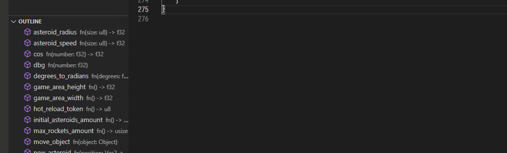

All features are in, our CI pipeline has been primed, the countdown has started.
The Core Team is putting the final touches on documentation for Mun v0.3, but otherwise we are ready for lift-off!

#### Mun v0.3 progress

* **feat: runtime linking** [[PR#300]](https://github.com/mun-lang/mun/pull/300)

  Adds the possibility to use multiple Mun files from a compiler and runtime perspective.

  When a new `*.munlib` is being written to disk by the compiler, we create and delete a lockfile to trigger relinking.
  As such, we no longer suffer from IO event delays in the runtime.

* **refactor: remove delay from runtime** [[PR#11]](https://github.com/mun-lang/runtime-ffi/pull/11)

* **refactor: make type-specific data (such as StructInfo) part of TypeInfo** [[PR#287]](https://github.com/mun-lang/mun/pull/287) [[PR#10]](https://github.com/mun-lang/runtime-ffi/pull/10) [[PR#9]](https://github.com/mun-lang/abi-c/pull/9)
  
  Generates a typed enum for `TypeInfo` in the C ABI, instead of unsafely appending additional data per `TypeInfo` entry.

  ```mun
  #[derive(AsValue)]
  pub struct TypeInfo {
      ...
      pub data: TypeInfoData,
  }

  #[derive(AsValue)]
  #[repr(u8)]
  pub enum TypeInfoData {
      Primitive,
      Struct(StructInfo),
  }
  ```
* **bump(rust): bumps Rust to 1.50** [[PR#310]](https://github.com/mun-lang/mun/pull/310)

* **feat(ci): add Github CI workflow** [[PR#12]](https://github.com/mun-lang/runtime-ffi/pull/12) [[PR#312]](https://github.com/mun-lang/mun/pull/312)

  Adds a CI workflow for building and testing our C/C++ Runtime bindings to GitHub.

* **feat(lsp): support for completions** [[PR#306]](https://github.com/mun-lang/mun/pull/306)

  

* **refactor: generate rust tests for code snippets in book** [[PR#311]](https://github.com/mun-lang/mun/pull/311)

  We now auto-generate Rust tests for all Mun code snippets in the Mun book during the build process, to always ensure that the book is up-to-date.

All desired changes for the Mun Compiler, Runtime, and Language Server have now been merged.
That means that we'll be working hard to update our documentation before releasing Mun v0.3 in the coming days.
Can't wait?
Please help us test the latest version of Mun by [building from source](https://github.com/mun-lang/mun#building-from-source).

Interested in what we are doing next?
Please check out our [high-level roadmap](https://github.com/mun-lang/mun/projects/2) on Github that details new features for future releases - Mun v0.4, and v0.5 - as well as a backlog of features that are still to come.

#### Community

If you are interested in helping develop Mun - but are not sure where to start - feel free to take a look at our [*good first issues*][gfi] or reach out to us on [Discord](https://discord.gg/SfvvcCU) or [Twitter][twi]. To support our cause, please consider donating to our [Open Collective][oc] or [Github Sponsors][gs].

[doh]: https://hacktoberfest.digitalocean.com
[gfi]: https://github.com/mun-lang/mun/issues?q=is%3Aissue+is%3Aopen+label%3A%22good+first+issue%22
[oc]: https://opencollective.com/mun
[gs]: https://github.com/sponsors/mun-lang
[twi]: https://twitter.com/munlangorg
